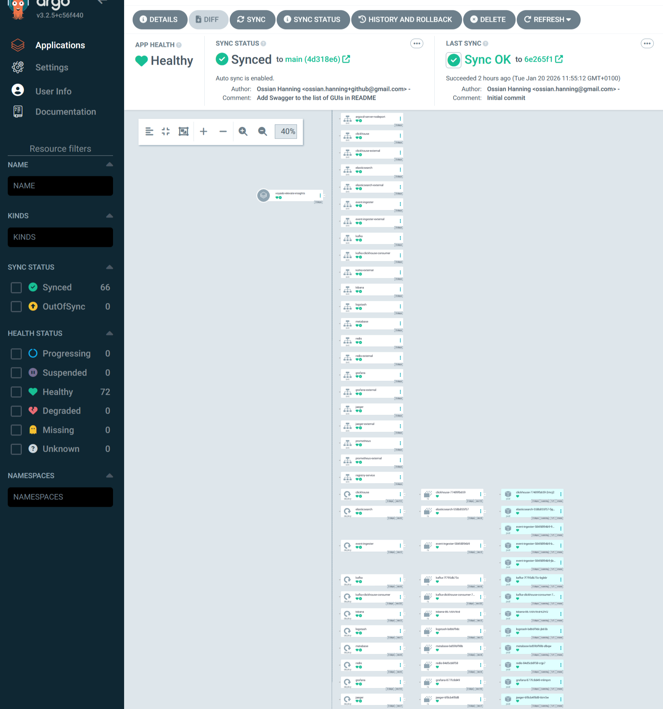
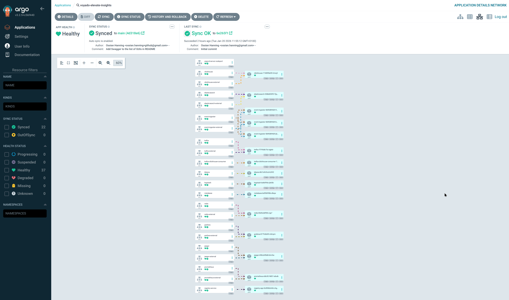
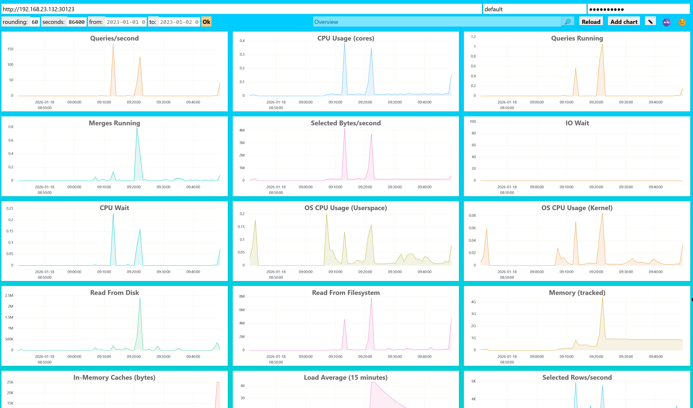
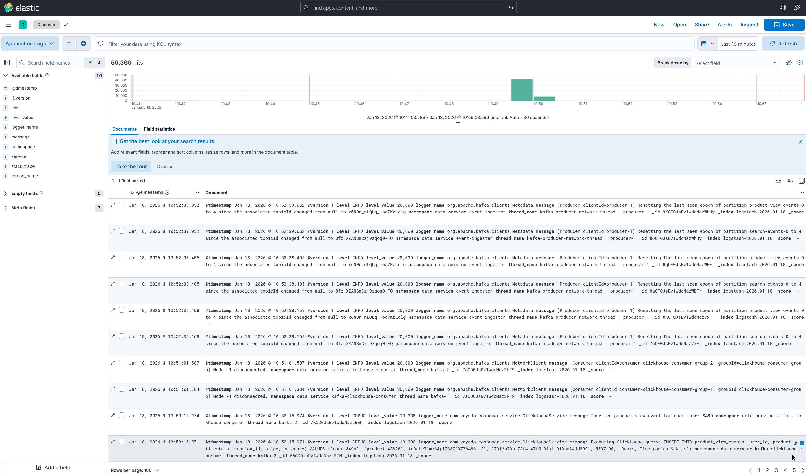
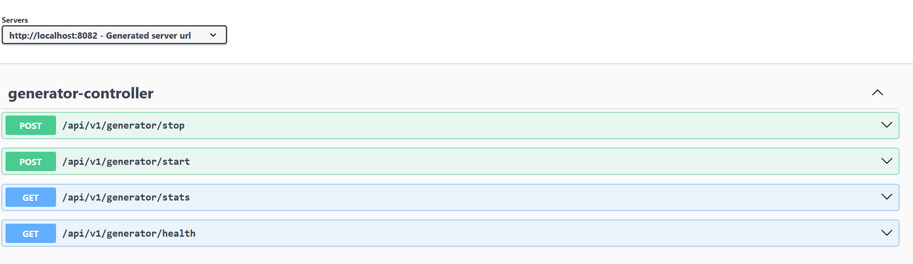
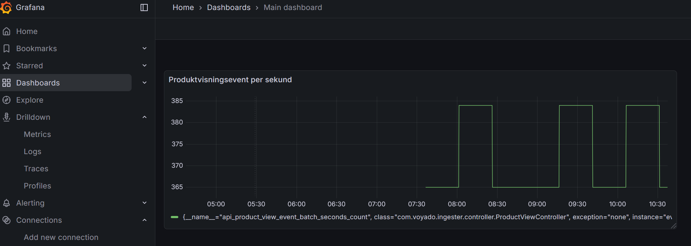
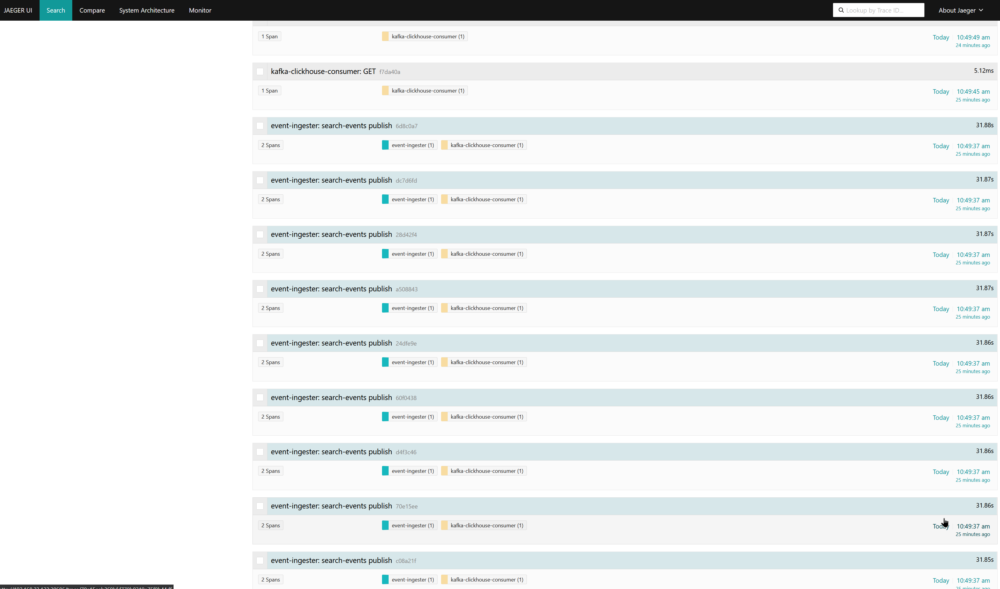
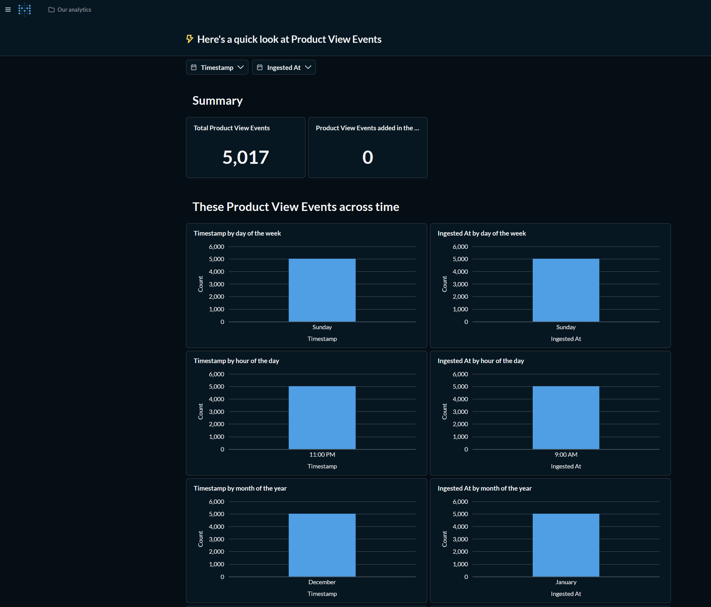
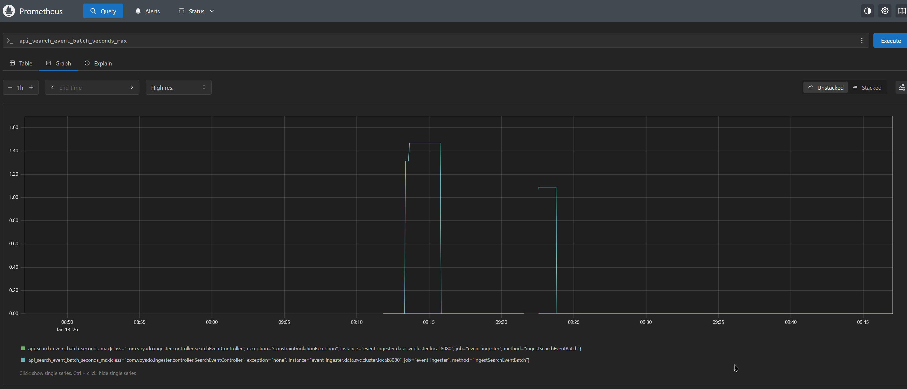

* This is just a minimal PoC. No GUI other than Jaeger/ELK/Prometheus/Grafana/Metabase/Swagger (for event-generator). 

* Argo is running in the cluster and configured to automatically deploy any changes to YAML files in k8s/-folder (via both webhook and polling), as well as the Docker images built and pushed to the private registry under the GitHub action that triggers on commit.

* Redis is not yet in use in this implementation, but all other Kubernetes deployments are live and configured/connected.

* Java applications should be stateless and easily scalable.

* This Kubernetes cluster is currently running on-premise on one of my machines (hence the Tailscale usage in the GitHub workflow) but could easily be deployed to AWS instead.

* No authentication/authorization or multi-tenancy support implemented at this stage, but would not necessarily have to be too complex. To enable this we'd probably want to add MariaDB or some other SQL instance to the cluster (or equivalent AWS alternative).

## Screenshots

### ArgoCD GitOps Deployment

### ClickHouse Analytics Database

### ELK Stack Logging

### Event Generator Swagger UI

### Grafana Dashboards

### Jaeger Distributed Tracing

### Metabase Analytics

### Prometheus Metrics

